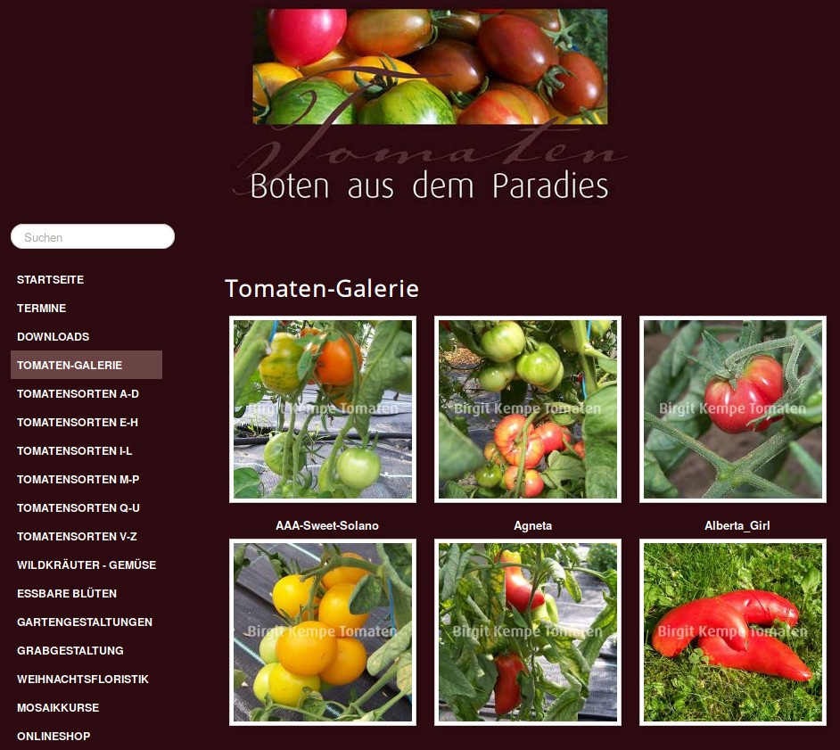
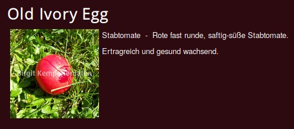

# Tomato Fetch Engine
This is a web scraper written in Python. It access this website: [Birgit Kempe Tomaten](https://www.birgit-kempe-tomaten.de/) and extracts all the data about the ~400 tomato varieties listed. See a screenshot of the website below:



## Features
The original website only offers an alphabetical list of all the tomato varieties, a picture to almost every variety and a non-standardized description to every single one of them. There are no shared attributes like `color` or `type` assigned to each tomato variety, making it hard to search the tomato database and apply filters like "only show me orange tomatoes" or "give me all cocktail or sweet tomatoes". This `Tomato Fetch Engine` does the first step in solving this problem. It not only scraps and stores all descriptions and images of all the tomatoes listed, it also adds some metadata. An original tomato entry looks like this:



The scraper fetches all that information and adds metadata about the color and the type of the variety, resulting in an entry like this:

```
{
    "name": "Old Ivory Egg",
    "description": "Stabtomate - Rote fast runde, saftig-süße Stabtomate. Ertragreich und gesund wachsend.",
    "image": "images/Old_Ivory_Egg.jpg",
    "link": "/de/tomatensorten-m-p/303-old-ivory-egg.html",
    "colors": [
        "rot"
    ],
    "types": [
        "Stabtomate"
    ]
}
``` 

Step #2 would be to feed all this results into a web application designed to show, browse and search this data more easily. The [Tomato Search Engine](https://github.com/charismatic-claire/tomato-search-engine) will do that.

## How to run using Linux BASH
```
$ cd tomato-fetch-engine
$ ./run.sh
```

## What to do with the result
Feed the resulting `res.tar.gz` it into the [Tomato Search Engine](https://github.com/charismatic-claire/tomato-search-engine)

## License
GPL-3.0-or-later
